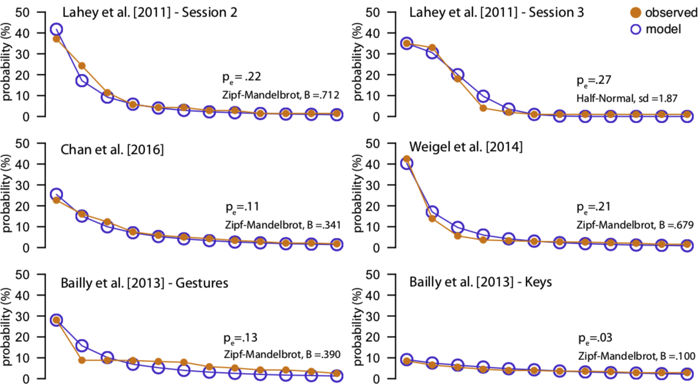

<author>Theophanis Tsandilas</author>
[ <email>theophanis.tsandilas@inria.fr</email> ]
<br/>Inria, Univ Paris-Sud, and Université Paris-Saclay

<div style="background-color:#F8F8FD;padding:26px;padding-top:1px;text-align:justify; outline-style:solid; outline-width:1px";>
##Abstract
Discovering gestures that gain consensus is a key goal of gesture elicitation. To this end, HCI research has developed statistical methods to reason about agreement. We review these methods and identify three major problems. First, we show that raw agreement rates disregard agreement that occurs by chance and do not reliably capture how participants distinguish among referents. Second, we explain why current recommendations on how to interpret agreement scores rely on problematic assumptions. Third, we demonstrate that significance tests for comparing agreement rates, either within or between participants, yield large Type I error rates ($> 40\%$ for $\alpha = .05$).

As alternatives, we present agreement indices that are routinely used in inter-rater reliability studies. We discuss how to apply them to gesture elicitation studies. We also demonstrate how to use common resampling techniques to support statistical inference with interval estimates. We apply these methods to reanalyze and reinterpret the findings of four gesture elicitation studies.</div> 

<br/>
**Keywords:** *Gesture elicitation, agreement rates, agreement indices, bias, chance agreement, kappa coefficients, confidence intervals, replication, statistics, content-analysis methods*

##Materials
The article will appear at the <i>ACM Transanctions on Computer-Human Interaction (TOCHI)</i>, but you can download a [[PDF; 2.9MB]](https://hal.archives-ouvertes.fr/hal-01788775/document) preprint, author version of the article (50 pages).

Results from additional experiments can be downloaded as suplementary material [[PDF; 128KB]](https://www.lri.fr/~fanis/tochi2018/tochi-supplementary.pdf).
You can also check the [R code](https://github.com/ephanis/TOCHI-supplementary) that I used for the analyses reported in the paper. A case study that demonstrates how to use it to analyze real datasets is available [on this page](https://www.lri.fr/~fanis/tochi2018/agreement-case-study.html).

The article is partly based on a research report that I co-authored with Pierre Dragicevic back in September 2015:

<blockquote style="font-size: 16px">
Theophanis Tsandilas and Pierre Dragicevic. [Accounting for Chance Agreement in Gesture Elicitation Studies](https://hal.archives-ouvertes.fr/hal-01267288/document). *Research Report 1584, LRI - CNRS, University Paris-Sud*, Feb 2016, 5 pages.
</blockquote>

**Special Acknowledgment:** Pierre's contribution to this work has been significant and includes writing, developing R code, and engaging in long discussions. I encourage the readers to check his page on [statistical communication for HCI](http://www.aviz.fr/badstats). 


This year, I opened an introductory [course on statistical methods](https://www.lri.fr/~fanis/courses/Stats2017/), which gave particular emphasis on how to test the assumptions of statistical procedures with simple Monte Carlo simulations. Many of the results that I report in the TOCHI article to evaluate the statistics are based on such simple simulations. The course's material is still preliminary, but I hope to drastically improve it in the folllowing academic years. 

<!-- A primary source of these problems is that work on gesture elicitation has overlooked decades of very related research in other domains. Such research has introduced a range of alternative measures to quantify agreement and has also investigated methods to support statistical inference. The most well-known agreement measure is Cohen's Kappa, but there are several others that cover different cases or make different probabilistic assumptions. The book of @gwet2014 on statistics for inter-rater reliability studies proved to be an excellent starting point for me.  -->

<!-- The relationship between a gesture-elicitation and a inter-rater reliability study may not look evident at first, but it can be easily understood by describing gesture elicitation as follows. Instead of asking a single person, e.g., a designer, to choose gestures for the commands of a new interactive system, the task is assigned to multiple independent people sampled from a target user population. The level of agreement among these people characterizes how subjective or *reliable* an assignment of gestures to commands is. Low agreement signifies that a common vocabulary cannot reliably represent the choices of a user population. -->

##Basic Terminology
@Wobbrock:2009 summarize a <emph>gesture elicitation study</emph> as follows: 

<blockquote style="font-size: 16px">
*Participants are prompted with <emph>referents</emph>, or the effects of actions, and perform <emph>signs</emph> that cause those actions.*
</blockquote>

In our analysis, we distinguish between the physical gestures performed by participants and their signs. A sign can be thought of as the interpretation of an observed gesture, or otherwise, as a category that groups together ”equal” or ”similar” gestures. The classification of observed gestures into signs is usually performed by humans.

If a sign occurs more than once for a referent, we infer that at least two participants <emph>agree</emph> on this sign. Researchers usually seek signs that enjoy wide agreement among users.

##Major Issues
To quantify agreement, a great number of elicitation studies have used the *A* index of @Wobbrock:2005. This index has been recently replaced by a more accurate measure, the agreement rate *AR* [@Findlater:2012;@Vatavu:2015]. @Vatavu:2015 argued for the adoption of the new index and provided guidelines on how to interpret agreement rates by suggesting ranges of low, medium, high, and very high agreement. Furthermore, they proposed the *Vrd* statistic for comparing agreement rates within participants. More recently, @Vatavu:2016 introduced the *Vb* statistic for comparing agreement rates between independent groups of participants. While statistics for analyzing agreement are important for gesture elicitation research, our article identifies serious problems in the above methods.

###The Problem of Chance Agreement
The notion of <emph>chance agreement</emph> has a central role in the formulation of most agreement indices [@gwet2014]. Chance agreement expresses the probability that any two raters agree by chance. Kappa coefficients correct for chance agreement with the following expression:

$$\kappa = \frac{p_a - p_e}{1 - p_e}$$
where $p_a$ is the proportion of items on which any two raters agree, and $p_e$ is the chance agreement. For many coefficients, such as Fleiss' Kappa, the former is identical to the Agreement Rate (*AR*) of @Vatavu:2015.

@Vatavu:2016 included a short discussion about chance-corrected coefficients and concluded that such statistics are not appropriate for gesture elicitation methodologies. Their argument is that gestural vocabularies are open-ended. Since participants choose from a infinite number of possibilities, the problem of chance agreement is non-existent. The TOCHI article extensively discusses their argumentation and rejects their conclusion. 

###Bias and Its Effect on Agreement
In practice, agreement is not assessed over an infinite set of gesture possibilities. Participants’ gesture proposals are first classified into signs, and agreement is assessed over the sign vocabulary defined by that specific classification process. However, the article shows that even if one assumes an infinite number of signs, the problem of chance agreement does not disappear. This is due to the presence of <emph>bias</emph>, the overall tendency of some signs to appear more frequently than others, independently of the referents. The article discusses usability, social, legacy, procedural, and classification biases, which can cause a small number of signs to dominate the results of a gesture elicitation study.

Bias increases the likelihood of chance agreement and makes the use of the AR index problematic. The interactive figures below demonstrate how bias affects agreement scores under a simulation setting, where participants are *blindfolded* while they propose gestures. As participants cannot see the referents, they try to randomly guess. However, it is possible that their guesses are biased towards a smaller set of gestures, such as obvious (or default) gestures or gestures that require less physical and cognitive effort. In this case, Fleiss' Kappa always gives values that are very close to zero, but AR values increase as bias becomes stronger. In other words, AR may also capture random agreements that are not specific to the referents of interest. Unfortunately, such agreements say nothing about how appropriate a given mapping between signs and referents is.

```{r, echo = FALSE}
source("bias-distribution.R")

shinyApp(
 ui <- fluidPage(
   fluidRow(
     column(4,
            selectInput("distribution", label = NULL, 
                       choices = list("Zipf-Mandelbrot distribution" = 1, "Discrete Half-Normal distribution" = 2), selected = 1)
            ),
     column(3,
            selectInput("bias", label = NULL, 
                       choices = list("Strong bias" = 1, "Medium bias" = 2, "Weak bias" = 3), selected = 1)
            )
   ),

  fluidRow(
     column(6, plotOutput(outputId = "distPlot", width = "100%", height = "260px")),
     # column(4, tableOutput("agreement"))
     column(6, plotOutput(outputId = "simPlot", width = "100%", height = "260px"))
   ),
  
    fluidRow(
     column(12, htmlOutput("caption")))
 ),
 
  server <- function(input, output) {
    participants <- 20
    referents <- 40
    steps <- 100 #Number of Monte Carlo iterations 
    
    # Initiate the reactive values here...
    vals <- reactiveValues(ar = c(), kappa = c(), counter = 0)
    
    output$distPlot <-  renderPlot({
      isolate({
        vals$ar <- c()
        vals$kappa <- c()
        vals$counter <- 0
      })
      
      if(input$bias == 1){
        B <- .646
        sd <- 2.58
      } else if(input$bias == 2){
        B <- .306
        sd <- 5.42
      } else {
        B <- .151
        sd <- 11.02
      }
      
      par(mar=c(5, 5, 0, 0))
      ifelse(input$distribution == 1, zipf.plot(B, 100000, 12, ymax = 0.4), normal.plot(sd, 100000, 12, ymax = 0.4))
      
      title(xlab="12 Most Frequenct Signs (infinite in number)", ylab="Probability (%)")
      axis(2, at = pretty(seq(0, 0.4, by = .1)), lab=pretty(seq(0, 0.4, by = .1))*100, las=1)
      axis(1, at = seq(1,12, by=1))
   })
    
  output$simPlot <- renderPlot({
      if(isolate(vals$counter == steps)){
        isolate({
          vals$ar <- c()
          vals$kappa <- c()
          vals$counter <- 0
        })
      }
    
      if(input$bias == 1){
        B <- .646
        sd <- 2.58
      } else if(input$bias == 2){
        B <- .306
        sd <- 5.42
      } else {
        B <- .151
        sd <- 11.02
      }
    
    if(input$distribution == 1){
      isolate(
        vals$ar <- simulation(vals$ar, participants, referents, zipf, B, percent.agreement.raw.noinference)
      )
      isolate(
        vals$kappa <- simulation(vals$kappa, participants, referents, zipf, B, fleiss.kappa.raw.noinference)
      )
    } 
    else{
      isolate(
        vals$ar <- simulation(vals$ar, participants, referents, normal, sd,  percent.agreement.raw.noinference)
      )
      
      isolate(
        vals$kappa <- simulation(vals$kappa, participants, referents, normal, sd, fleiss.kappa.raw.noinference)
      )
    } 

    N <- 60
    min <- -.1
    max <- .3
        
    par(mar=c(5, 5, 1, 0))
    plot.distribution_(isolate(vals$kappa), N, min, max)
    plot.distribution(isolate(vals$ar), N, min, max)
    
    title(xlab="Agreement Score", ylab="Probability (%)")
    legend("topright", inset=.01, legend=c("Fleiss' Kappa", "Agreement Rate (AR)"), 
           fill=c(rgb(.86,.86,.95), rgb(.93,.8,.5)), horiz=FALSE, cex=1, box.lty=0)

    isolate({ vals$counter <- vals$counter + 1})

    text <- paste0("Completed: ", isolate(vals$counter), " out of ", steps, " iterations")
    mtext(text, side=3)

    if(isolate(vals$counter) < steps){
      invalidateLater(100, session)
    }
   })
  
   output$caption <- renderUI({
     HTML(paste("The <b>left plot</b> shows the bias distribution, when some signs are more likely to be selected than others. The <b>right plot</b> shows the distributions of agreement scores that result from such bias, when 20 <b>blindfolded participants</b> iteratively propose signs for 40 referents. We observe that <b>AR is greater than zero</b> despite the fact that participants cannot see the referents for which they propose gestures."))
   }) 
   
  }, options = list(height = 380)
)
```

Readers may wonder whether such bias levels are realistic. The figure below shows bias distributions observed in four gesture elicitation studies published at CHI. We see that bias can be particulary high and can vary considerably across studies. This indicates that comparisons based on agreement rates are generally problematic. 

<center>
{ width=760px }
<div style="padding:36px;padding-top:8px;padding-bottom:0px;font-size:14px"><b style="color:sienna">Observed</b> bias distributions for our four case studies. </br>We also show the <b style="color:DarkBlue">closest model</b> of bias distribution and the overall probability of chance agreement $p_e$.</div>
</center>

###Interpreting Agreement Values
@Vatavu:2015 proposed some generic guidelines on how to interpret the magnitude of agreement: AR < .100 is low agreement, .100 < AR < .300 is medium, .300 < AR < .500 is high, and AR > .500 is very high agreement. The guidelines derive from two types of analysis: (1) a probabilistic reasoning, and (2) a survey of agreement rates from past studies. 

We showed earlier that AR can be misleading about the level of true agreement. For example, agreement rates for the study of @lahey2011 were AR = .251 (Session 2) and AR = .298 (Session 3). These values correspond to <b>medium agreement</b> according to @Vatavu:2015. However, our analysis shows a very low chance-corrected agreement for this study, where Fleiss' Kappa is equal to .040, 95% CI [-.064, .144] for Session 2, and .043, 95% CI [-.056, .141] for Session 3. These values are not even statistically significantly higher than zero. 

This analysis confirms the conclusion of the authors who state: <i>"the consensus on the mapping of those bend gestures to actions was overall low, showing that each participant had his or her own preference”</i> [@lahey2011]. In this case, the authors relied on intuition and common sense to reach the right conclusion, despite the fact that their A scores were similar or higher than representative averages of older gesture-elicitation studies [@Wobbrock:2005;@Wobbrock:2009].

Even if one forgets the problem of chance agreement, the probabilistic reasoning of @Vatavu:2015 has flaws that lead to arbitrary conclusions. The article further explains that even if one corrects these flaws, relying on statistics to assess the magnitude of agreement is not feasible. To this end, we need other criteria, such as usability metrics and longer-term studies.

###Statistical Inference
The third issue that the article investigates is how to support statistical inference. A careful analysis of the *Vrd* and the *Vb* statistics of Vatavu and Wobbrock shows that the probabilistic reasoning that the authors used to derive them has flaws. Our Monte Carlo simulations further demonstrate that both statistics yield Type I error rates that are orders of magnitude higher than their nominal levels. 

The following figure shows a live evaluation of the *Vrd* statistic. We repeatedly generate N random samples of proposals for two referents, where N represents the number of participants in a gesture elicitation study. We repeat the process by taking samples from nine source populations, where each approximates a different agreement rate AR, from .10 to .90. We observe that Type I errors are extremely large. The evaluation of the Vb statistic yields similar results, where Type I errors are again unacceptably high.

```{r, echo = FALSE}
source("Vrd.evaluation.R")

betas <- c(.306, .64, 1.05, 1.56, 2.25, 3.26, 5.0, 8.3, 18.4)
ar.levels <- c(".1", ".2", ".3", ".4", ".5", ".6", ".7", ".8", ".9")

# Create a population from a Zipf distribution
population.zipf <- function(N, beta){
    ZM <- lnre("zm", alpha = 1/2, B = beta)
    rlnre(ZM, n = N)
}

shinyApp(
 ui <- fluidPage(
   fluidRow(
     column(3, selectInput("alpha", label = NULL, 
                        choices = list("alpha = .05" = 1, "alpha = .01" = 2), selected = 1)),
      
     column(3, selectInput("participants", label = NULL, 
                        choices = list("N = 10 participants" = 1, "N = 20 participants" = 2, "N = 30 participants" = 3), selected = 2))
   ),

  fluidRow(
     column(8, offset = 2, plotOutput(outputId = "vrdPlot", width = "100%", height = "280px"))
   ),
  
  fluidRow(
   column(12, htmlOutput("caption")))
 ),
 
  server <- function(input, output) {
    steps <- 300 #Number of Monte Carlo iterations 
    L <- 9 # I calculate errors for AR = .1, .2, ..., .9
    
    # Initiate the reactive values here...
    vals <- reactiveValues(counter = 0, errors.vrd = rep(0, L))
    
    output$vrdPlot <- renderPlot({
      if(isolate(vals$counter == steps)){
        isolate({
          vals$ar <- c()
          vals$kappa <- c()
          vals$counter <- 0
        })
      }
      
      if(input$alpha == 1) alpha <- .05
      else alpha <- .01
      
      if(input$participants == 1){
        participants = 10
      } else if(input$participants == 2){
        participants = 20
      } else {
        participants = 30
      }
      
      isolate(
        vals$errors.vrd <- typeI.simulation(vals$errors.vrd, population.zipf, participants, betas, alpha)
      )
      
      isolate({ vals$counter <- vals$counter + 1})
      err <- isolate(vals$errors.vrd) / isolate(vals$counter)
      
      plot.error(err, ar.levels, alpha)
      title(xlab="Population AR", ylab="Type I Error Rate (%)")
      
      text <- paste0("Completed: ", isolate(vals$counter), " out of ", steps, " iterations")
      mtext(text, side=3)
      
      if(isolate(vals$counter) < steps){
        invalidateLater(200, session)
      }
    })
  
    output$caption <- renderUI({
      if(input$participants > 0){
        if(input$alpha == 1 || input$alpha == 2){
          isolate({
            vals$errors.vrd <- rep(0, L)
            vals$counter <- 0
          })        
        }
      }

      HTML(paste("Monte Carlo simulation that estimates the <b>Type I error rate of the Vrd</b> statistical test for nine populations with AR values from .10 to .90. Error rates are orders of magnitude larger than their nominal levels (<b style = \"color:red\">reference line in red</b>) and grow as the number of participants increases."))
   }) 
  }, options = list(height = 380)
)
```

The evaluations reported in the article consider different distribution models to simulate participants' proposals. Our analysis of four gesture elicitation studies shows that models based on <b>Zipf-Mandelbrot distributions</b> approximate well frequencies that emerge in real datasets. The simulation on the figure above makes use of such models.

##Remedies and Recommendations
Fortunately, other research disciplines have long established methods to support statistical inference for agreement indices [@gwet2014]. Those are based on interval estimation and resampling methods, in particular jackknifing [@quenouille1949] and bootstrapping [@efron1979]. The TOCHI article further evaluates them in the context of gesture elicitation and shows how to apply them to analyze real datasets. The article also discusses limitations of such methods. In particular, jackknife and bootstrap confidence intervals may not be precise when applied to individual referents, and sample sizes are small. In such cases, driving conclusions based on statistical significance is not a good practice. 

Overall, a single statistic is not enough to capture the results of a gesture elicitation study. My recommendation is to report both raw percent agreement and chance-corrected agreement indices, as well as agreement indices specific to individual signs. A separate investigation of the observed bias distribution is also recommended for every gesture elicitation study. Finally, agreement scores have little value by themselves. In order to interpret them, one needs to know exactly what participants agree upon, i.e., know how signs are defined and how proposals are classified into these signs. It is therefore imperative that authors clarify how they define their sign vocabularies, how they classify observed gestures into these vocabularies, and how they verify the reliability of this classification process.

##Feedback and Comments
I am not a statistician, and writing this artcile has been a learning process for me. I will appreciate any feedback on mistakes or other problems that you may discover in my analyses. I am also interested in comments and suggestions on how to improve or extend this work. 

Creating an easy-to-use R package for the the statistics recommended by the article is a future goal. For the moment, you can use the [R code](https://github.com/ephanis/TOCHI-supplementary) provided as supplementary material. Please, go through [the case study](https://www.lri.fr/~fanis/tochi2018/agreement-case-study.html) for concrete examples. Feel free to contact me to indicate problems or ask questions.

This page has been implemented with [Shiny](https://shiny.rstudio.com/), and its code can be downloaded from [here](https://github.com/ephanis/Agreement-TOCHI).

##References

